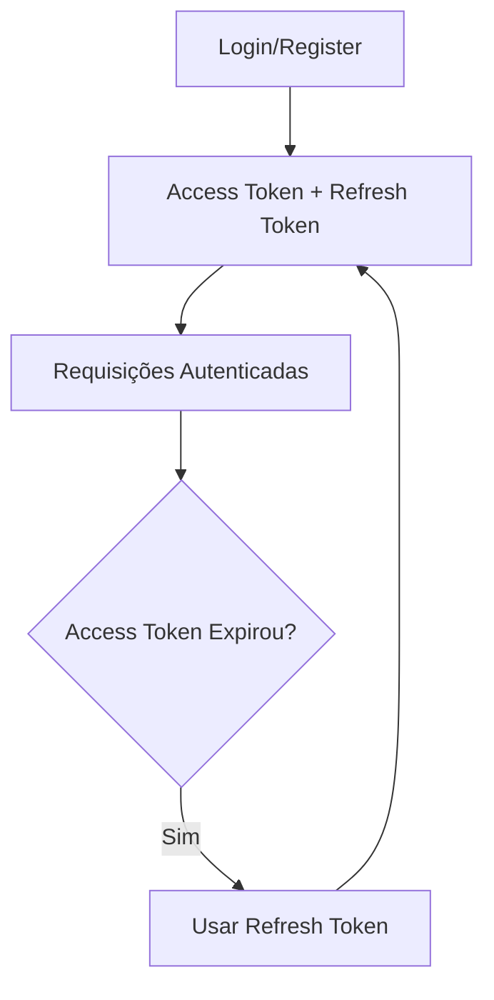

#  CRUD API com Autenticação e Roles

API RESTful desenvolvida com **Node.js** para gerenciamento simples de usuários, com sistema de autenticação utilizando **JWT** e controle de acessos baseado em **roles** (admin/user). Todos os dados são armazenados em um banco **PostgreSQL**.

---

##  Tecnologias Utilizadas

| Tecnologia | Descrição |
|------------|-----------|
| **Node.js** | Runtime JavaScript |
| **Express** | Framework web |
| **Zod** | Validação de dados |
| **PostgreSQL** | Banco de dados |
| **JWT** | Autenticação |
| **Bcrypt** | Hash de senhas |

---

##  Funcionalidades

- Cadastro de usuário
- Login com geração de token JWT
- Logout com invalidação de tokens
- Controle de acessos por roles (**USER** / **ADMIN**)
- Refresh de tokens
- Visualizar informações do usuário
- Atualizar dados do usuário
- Deletar usuário

---

##  Autenticação

A autenticação é realizada via **tokens JWT**. Ao fazer **login** ou **register**, são gerados:

- **Access Token**: Duração curta, usado para autenticação nas requisições
- **Refresh Token**: Duração longa, usado para renovar o access token quando expira



---

##  Sistema de Roles

Controle de acesso baseado em roles:

| Role | Permissões |
|-----|------------|
| **user** | Acesso básico aos próprios dados |
| **admin** | Acesso completo a todos os usuários |

**Exemplos:**
- **Admin**: Listar todos os usuários
- **User**: Acessar apenas seus próprios dados

---

## Instalação

### 1. Clone o repositório
```bash
git clone https://github.com/Dan-pie/Crud_api
cd Crud_Api
```

### 2. Instale as dependências
```bash
npm install
```

### 3. Configure as variáveis de ambiente
Crie um arquivo `.env` na raiz do projeto:

```env
PORT=3000
JWT_SECRET=sua_chave_secreta_aqui
JWT_REFRESH_SECRET=sua_chave_refresh_aqui

DB_HOST=localhost
DB_USER=seu_usuario
DB_PASSWORD=sua_senha
DB_NAME=nome_do_banco
DB_PORT=5432
```

### 4. Execute o projeto
```bash
npm run dev
```
---

## Testes

Teste a API utilizando:
- [Postman](https://www.postman.com/)
- [Insomnia](https://insomnia.rest/)

---

## Endpoints

| Método | Endpoint | Descrição | Role Necessária |
|--------|----------|-----------|-----------------|
| `POST` | `/signUp` | Registrar novo usuário | - |
| `POST` | `/signIn` | Login do usuário | - |
| `POST` | `/refresh` | Renovar tokens | - |
| `POST` | `/logout` | Logout (invalida tokens) | User/Admin |
| `GET` | `/users/findAll` | Listar todos os usuários | **Admin** |
| `GET` | `/users/me` | Ver dados do usuário logado | User/Admin |
| `GET` | `/users/:id` | Ver dados de usuário específico | **Admin** |
| `PUT` | `/users/me` | Atualizar dados próprios | User/Admin |
| `PUT` | `/users/:id` | Atualizar dados de outro usuário | **Admin** |
| `DELETE` | `/users/me` | Deletar conta própria | User/Admin |
| `DELETE` | `/users/:id` | Deletar outro usuário | **Admin** |
| `PUT` | `/:id/role` | Alterar role de usuário | **Admin** |
